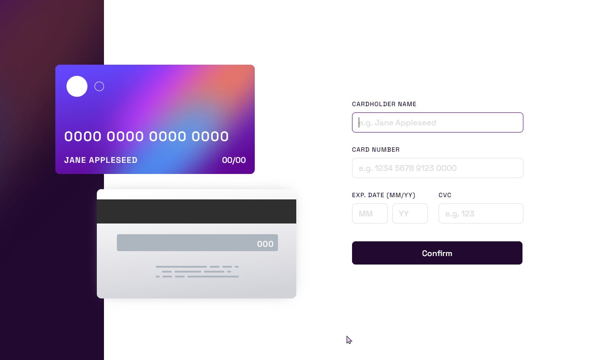
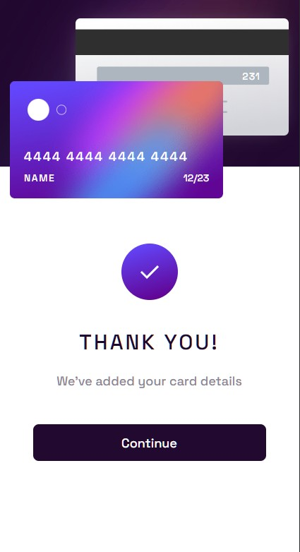
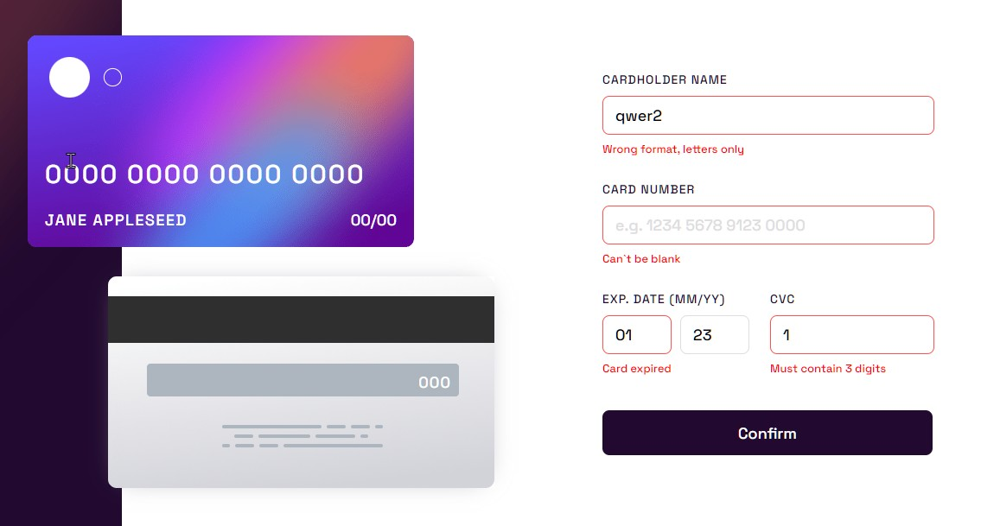

This is a solution to the [Interactive card details form challenge on Frontend Mentor](https://www.frontendmentor.io/challenges/interactive-card-details-form-XpS8cKZDWw). Frontend Mentor challenges help you improve your coding skills by building realistic projects.

## Overview

### The challenge

Users should be able to:

- Fill in the form and see the card details update in real-time
- Receive error messages when the form is submitted if:
  - Any input field is empty
  - The card number, expiry date, or CVC fields are in the wrong format
- View the optimal layout depending on their device's screen size
- See hover, active, and focus states for interactive elements on the page

Before sending data there are checks such checks as:
- checking all fields for empty
- checking the name field for the absence of numbers in it
- checking the card number field for the content of 16 digits in it
- if the user entered a number from 1 to 9 in the date field, 0 is added in front of it
- checking the month for a number from 1 to 12
- checking the validity of the card for a valid one (a year not earlier than the current one, a month not earlier than the next one in the current year)
- checking the CVC code for the presence of 3 digits in it

### Screenshot

### Links

- [Solution URL](https://github.com/EugiSs/interactive-bank-card/tree/main)
- [Live Site URL](https://eugiss.github.io/interactive-bank-card/)

## My process

### Built with

- Vue3 composition
- Semantic HTML5 markup
- SCSS custom properties
- Flexbox

### What I learned

app development with Vue3

## Author

- Frontend Mentor - [@Eugi](https://www.frontendmentor.io/profile/EugiSs)
